<!-- ══════════════════════════ HEADER ══════════════════════════ -->

  

 

 

<!-- ══════════════════════════ ABOUT ══════════════════════════ -->

## `01` &nbsp;Who I am

Full stack engineer with **4.5+ years** shipping production software — Spring Boot services on the back, React interfaces on the front, AWS underneath, and the pager that comes with owning all three.

Most recently I built a cyber-insurance SaaS platform end to end: OTP auth, Stripe broker onboarding, secrets management, custom health probes, load testing. I like clean service boundaries, interfaces that stay fast on a mid-range phone, and p99s that tell the truth.

|  |  |
| :--- | :--- |
| **Now** | System Engineer @ Tata Consultancy Services |
| **Stack** | Java · Spring Boot · React · AWS · Redis |
| **Building** | FitFuel — nutrition and training tracker |
| **Ask me about** | Spring Boot internals, React performance, breaking things under load |
| **Off-screen** | Mountains, long rides, and a Husqvarna Svartpilen 250 |

 

<b>&nbsp;Things I've broken, fixed, and written up →</b>

 

<!-- TODO: sharpen these with real numbers — "cut p99 from Xms to Yms",
     "found the ceiling at N concurrent users". Specifics are what make
     this section land in an interview. -->

- **A schema mismatch in production** — root-caused a data integrity incident and wrote the RCA, then added the check that would have caught it earlier.
- **Secrets living in config files** — migrated a live platform onto AWS Secrets Manager with Spring Cloud AWS.
- **Health checks that lied** — replaced default actuator probes with custom indicators that actually exercise downstream dependencies.
- **Load limits nobody had measured** — built a k6 harness to find the breaking point before customers did.
- **TLS failures in transactional email** — debugged and fixed a Brevo SMTP handshake issue that was silently dropping mail.

 

<!-- ══════════════════════════ STACK ══════════════════════════ -->

## `02` &nbsp;Toolbox

<table>
<tr>
<td valign="top" width="50%">

**Frontend**

**Data**

**Testing & tooling**

</td>
<td valign="top" width="50%">

**Backend**

**Cloud & DevOps**

**Languages**

</td>
</tr>
</table>

 

<!-- ══════════════════════════ WORK ══════════════════════════ -->

## `03` &nbsp;Selected work

<table>
<tr>
<td width="50%" valign="top">

### FitFuel

Indian-first calorie, macro and workout tracker with coaching built in.
Installable PWA — offline-capable, native-feel on mobile.

<!-- TODO: correct these to your actual stack -->
`React` &nbsp;`PWA` &nbsp;`Vercel`

</td>
<td width="50%" valign="top">

### Tally

Group expense splitting — running balances, settle-up, and a
per-group ledger so nobody has to remember who paid for dinner.

`Next.js` &nbsp;`PWA` &nbsp;`Tailwind CSS` &nbsp;`Zustand` &nbsp;`MongoDB` &nbsp;`web-push` &nbsp;`Firebase Authentication`

</td>
</tr>
</table>

 

<!-- ══════════════════════════ STATS ══════════════════════════ -->

## `04` &nbsp;By the numbers

  

<!-- Generated by .github/workflows/snake.yml — see setup note in that file -->
<picture>
  <source media="(prefers-color-scheme: dark)"  srcset="https://raw.githubusercontent.com/biswajitdas-007/biswajitdas-007/output/snake-dark.svg" />
  <source media="(prefers-color-scheme: light)" srcset="https://raw.githubusercontent.com/biswajitdas-007/biswajitdas-007/output/snake.svg" />
  
</picture>

 

<!-- ══════════════════════════ CONNECT ══════════════════════════ -->

## `05` &nbsp;Say hello

Happy to talk shop — API design, React performance, or where a piece of logic should live in a system.

<!-- Uncomment when you want these live:

-->
